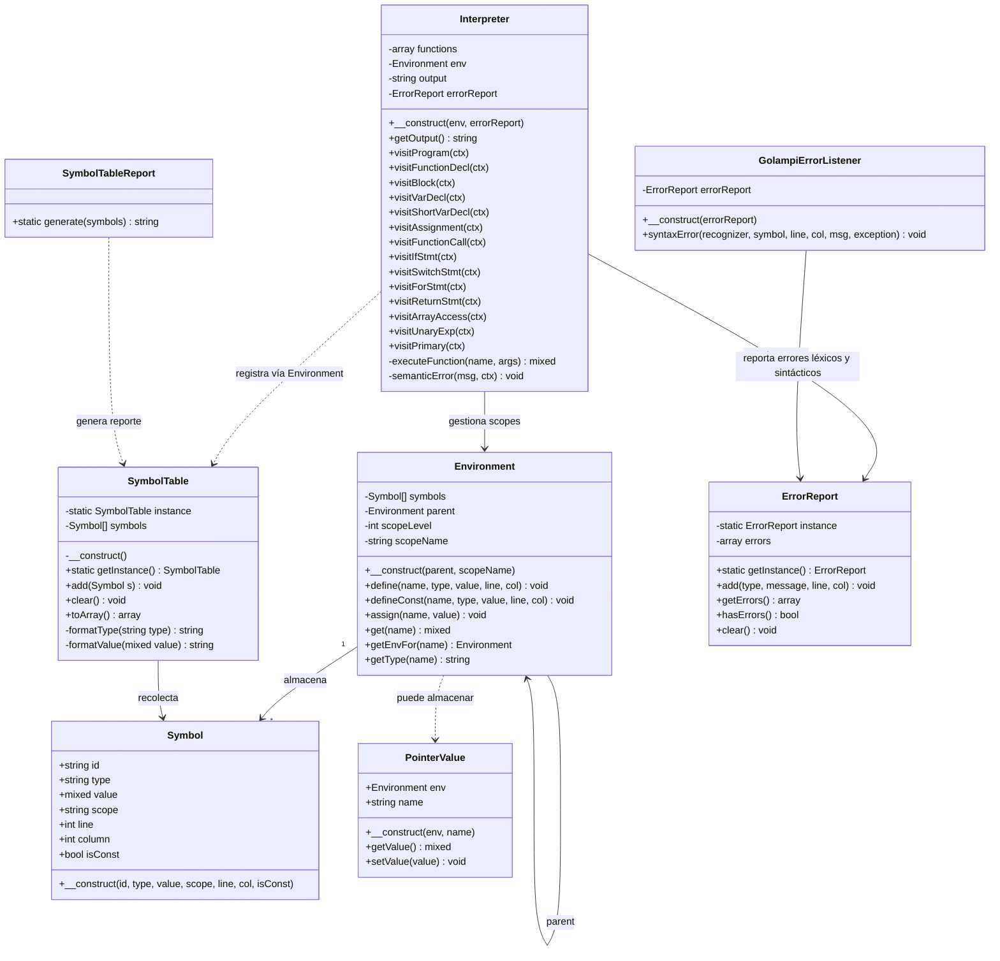
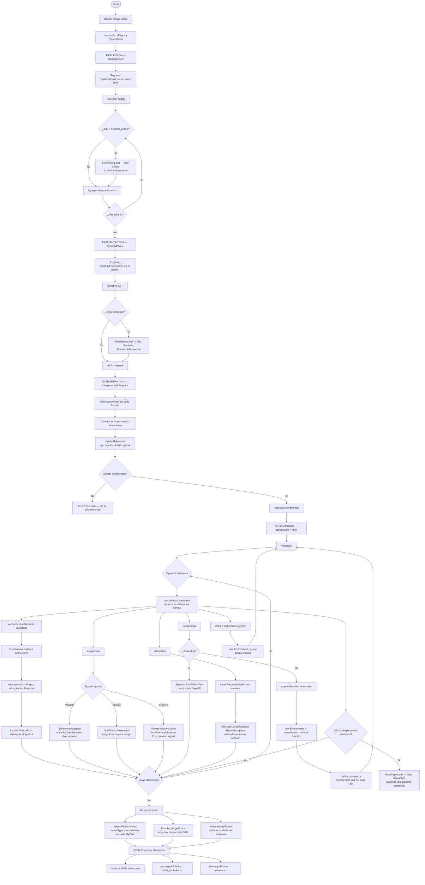

# Manual Técnico - Golampi

## Angel Emanuel Rodriguez Corado - 202404856

---

## 1. Gramática Formal de Golampi

Golampi es un lenguaje de programación inspirado en Go, procesado mediante ANTLR4 con un backend en PHP. A continuación se presenta cada regla de la gramática con su descripción.

---

### program

```antlr
program
    : functionDecl* EOF
    ;
```

Regla raíz del lenguaje. Un programa es una secuencia de cero o más declaraciones de función seguidas del fin de archivo. Todo el código de Golampi debe estar contenido dentro de funciones.

---

### functionDecl

```antlr
functionDecl
    : FUNC IDENTIFIER LPAREN params? RPAREN returnTypes? block
    ;
```

Declaración de una función con nombre, lista de parámetros opcional, tipos de retorno opcionales y un bloque de código. Es la unidad de organización principal del lenguaje.

---

### params y param

```antlr
params
    : param (COMMA param)*
    ;

param
    : IDENTIFIER type
    ;
```

Lista de parámetros que recibe una función al ser invocada. Cada parámetro está formado por un nombre y su tipo. Los parámetros se separan por coma.

---

### returnTypes

```antlr
returnTypes
    : type
    | LPAREN type (COMMA type)* RPAREN
    ;
```

Tipos de retorno de una función. Puede ser un único tipo o múltiples tipos entre paréntesis, lo que permite que una función devuelva más de un valor simultáneamente.

---

### block

```antlr
block
    : LBRACE statement* RBRACE
    ;
```

Bloque de código delimitado por llaves. Contiene cero o más instrucciones y define un nuevo ámbito (scope) de variables independiente del exterior.

---

### statement

```antlr
statement
    : statementCore SEMICOLON?
    ;
```

Una instrucción individual dentro de un bloque. El punto y coma al final es opcional, siguiendo la convención de Go.

---

### statementCore

```antlr
statementCore
    : functionCall
    | varDecl
    | constDecl
    | shortVarDecl
    | assignment
    | incDecStmt
    | ifStmt
    | switchStmt
    | forStmt
    | breakStmt
    | continueStmt
    | returnStmt
    | expression
    ;
```

Núcleo de una instrucción. Actúa como punto de distribución hacia todas las formas posibles de instrucción del lenguaje: llamadas a función, declaraciones de variables y constantes, asignaciones, control de flujo, ciclos y transferencias.

---

### varDecl

```antlr
varDecl
    : VAR idList type (ASSIGN expList)?
    | VAR IDENTIFIER arrayType (ASSIGN arrayLiteral)?
    ;
```

Declaración explícita de variable con la palabra reservada `var`. La primera forma maneja tipos simples y permite declarar múltiples variables a la vez. La segunda forma es exclusiva para arreglos con su tipo dimensional. El valor inicial es opcional en ambos casos.

---

### constDecl

```antlr
constDecl
    : CONST IDENTIFIER type ASSIGN expression
    ;
```

Declaración de una constante. Requiere nombre, tipo y valor obligatorio. Una vez definida no puede modificarse durante la ejecución del programa.

---

### shortVarDecl

```antlr
shortVarDecl
    : idList SHORT_ASSIGN expList
    ;
```

Declaración corta con `:=`. El tipo se infiere automáticamente a partir del valor asignado. Permite declarar múltiples variables en una sola línea y es la forma más común de declaración en Golampi.

---

### assignment

```antlr
assignment
    : assignTarget assignOp expList
    ;
```

Asignación de uno o más valores a uno o más destinos. Cubre asignación simple y asignaciones compuestas con operación aritmética integrada.

---

### assignTarget

```antlr
assignTarget
    : idList
    | arrayAccess
    | pointerAccess
    ;
```

Destino de una asignación. Puede ser una variable simple, un elemento de un arreglo accedido por índice, o una variable accedida a través de un puntero.

---

### assignOp

```antlr
assignOp
    : ASSIGN
    | PLUS_ASSIGN
    | MINUS_ASSIGN
    | MULT_ASSIGN
    | DIV_ASSIGN
    ;
```

Operador de asignación. El `=` reemplaza el valor actual. Los operadores compuestos (`+=`, `-=`, `*=`, `/=`) aplican la operación aritmética sobre el valor existente y lo reemplazan en un solo paso.

---

### idList y expList

```antlr
idList
    : IDENTIFIER (COMMA IDENTIFIER)*
    ;

expList
    : expression (COMMA expression)*
    ;
```

Lista de identificadores y lista de expresiones separadas por coma. Se usan juntas para soportar declaraciones y asignaciones múltiples en una sola instrucción.

---

### type, baseType, pointerType

```antlr
type
    : baseType
    | arrayType
    | pointerType
    ;

baseType
    : INT_TYPE | FLOAT_TYPE | BOOL_TYPE | STRING_TYPE | RUNE_TYPE
    ;

pointerType
    : MULT type
    ;
```

Jerarquía de tipos del lenguaje. Un tipo puede ser primitivo (`int`, `float`, `bool`, `string`, `rune`), un arreglo de cualquier dimensión, o un puntero a otro tipo. Los punteros pueden apuntar a cualquier tipo incluyendo otros punteros.

---

### arrayType y arrayDimension

```antlr
arrayType
    : arrayDimension+ baseType
    ;

arrayDimension
    : LBRACK INT_LITERAL RBRACK
    ;
```

Tipo arreglo formado por una o más dimensiones seguidas del tipo base. Cada dimensión se expresa como un número entero entre corchetes. Múltiples dimensiones definen arreglos multidimensionales.

---

### arrayLiteral, arrayElements y arrayElement

```antlr
arrayLiteral
    : arrayType LBRACE arrayElements? RBRACE
    ;

arrayElements
    : arrayElement (COMMA arrayElement)* COMMA?
    ;

arrayElement
    : expression
    | LBRACE arrayElements? RBRACE
    ;
```

Literal de arreglo que especifica tipo y valores iniciales en una sola expresión. Los elementos pueden ser expresiones simples o sub-arreglos entre llaves para arreglos multidimensionales. Se permite una coma final opcional tras el último elemento.

---

### arrayAccess y arrayIndex

```antlr
arrayAccess
    : IDENTIFIER arrayIndex+
    ;

arrayIndex
    : LBRACK expression RBRACK
    ;
```

Acceso a un elemento de arreglo mediante índices entre corchetes. Soporta múltiples índices consecutivos para acceder a elementos en arreglos multidimensionales.

---

### pointerAccess

```antlr
pointerAccess
    : MULT+ IDENTIFIER
    ;
```

Desreferenciación de un puntero para leer el valor al que apunta. El uso de múltiples `*` consecutivos permite navegar varios niveles de indirección.

---

### functionCall y functionName

```antlr
functionCall
    : functionName LPAREN args? RPAREN
    ;

functionName
    : IDENTIFIER (DOT IDENTIFIER)?
    ;

args
    : expList
    ;
```

Invocación de una función con argumentos opcionales. El nombre de la función puede incluir un prefijo de namespace separado por punto, lo que permite las funciones embebidas del lenguaje como `fmt.Println`.

---

### expression y jerarquía de operadores

```antlr
expression      : logicalOrExp ;
logicalOrExp    : logicalAndExp (OR logicalAndExp)* ;
logicalAndExp   : equalityExp (AND equalityExp)* ;
equalityExp     : relationalExp ((EQUAL | NOT_EQUAL) relationalExp)* ;
relationalExp   : additiveExp ((LESS | LESS_EQUAL | GREATER | GREATER_EQUAL) additiveExp)* ;
additiveExp     : multiplicativeExp ((PLUS | MINUS) multiplicativeExp)* ;
multiplicativeExp : unaryExp ((MULT | DIV | MOD) unaryExp)* ;
```

Jerarquía de expresiones que establece la precedencia de operadores de menor a mayor: OR lógico → AND lógico → igualdad → relacional → suma/resta → multiplicación/división/módulo. Cada nivel delega hacia el siguiente, garantizando el orden correcto de evaluación.

---

### unaryExp

```antlr
unaryExp
    : NOT unaryExp
    | MINUS unaryExp
    | MULT unaryExp
    | AMP unaryExp
    | primary
    ;
```

Expresiones con operador prefijo unario. `!` invierte un booleano, `-` niega aritméticamente un número, `*` desreferencia un puntero y `&` obtiene la dirección de memoria de una variable creando un puntero hacia ella.

---

### primary

```antlr
primary
    : functionCall | arrayAccess | pointerAccess | arrayLiteral
    | INT_LITERAL | FLOAT_LITERAL | STRING | RUNE_LITERAL
    | TRUE | FALSE | NIL | IDENTIFIER
    | LPAREN expression RPAREN
    ;
```

Expresión primaria, la unidad más básica de evaluación. Abarca todos los literales del lenguaje, identificadores de variables, llamadas a función, accesos a arreglo y puntero, literales de arreglo, y expresiones agrupadas entre paréntesis.

---

### ifStmt

```antlr
ifStmt
    : IF (simpleStmt SEMICOLON)? expression block (ELSE (ifStmt | block))?
    ;
```

Sentencia condicional. Evalúa una expresión booleana y ejecuta el bloque si es verdadera. Soporta un statement inicializador opcional antes de la condición, encadenamiento de `else if` y un bloque `else` final.

---

### switchStmt, caseClause y defaultClause

```antlr
switchStmt
    : SWITCH expression LBRACE caseClause* defaultClause? RBRACE
    ;

caseClause
    : CASE expList COLON statement*
    ;

defaultClause
    : DEFAULT COLON statement*
    ;
```

Sentencia de selección múltiple. Evalúa una expresión y ejecuta el bloque del `case` cuyo valor coincida. Un `case` puede listar múltiples valores separados por coma. El `default` se ejecuta cuando ningún `case` coincide.

---

### forStmt y forClause

```antlr
forStmt
    : FOR forClause block
    | FOR expression block
    | FOR block
    ;

forClause
    : simpleStmt SEMICOLON expression SEMICOLON simpleStmt
    ;
```

Sentencia de iteración con tres variantes: el `for` clásico con inicializador, condición y post-instrucción; el estilo `while` con solo una condición; y el ciclo infinito sin condición. El `forClause` define los tres componentes del ciclo clásico separados por punto y coma.

---

### simpleStmt, incDecStmt, shortVarDeclNoSemi y assignmentNoSemi

```antlr
simpleStmt
    : shortVarDeclNoSemi | assignmentNoSemi | incDecStmt
    ;

incDecStmt          : IDENTIFIER (INC | DEC) ;
shortVarDeclNoSemi  : idList SHORT_ASSIGN expList ;
assignmentNoSemi    : assignTarget assignOp expList ;
```

Statements simples usados dentro del encabezado del `for`. Son versiones sin punto y coma al final de la declaración corta, la asignación y el incremento/decremento, adaptadas para caber en la cláusula `init` y `post` del ciclo clásico.

---

### breakStmt, continueStmt y returnStmt

```antlr
breakStmt    : BREAK ;
continueStmt : CONTINUE ;
returnStmt   : RETURN expList? ;
```

Instrucciones de transferencia. `break` interrumpe inmediatamente el ciclo `for` o el `switch` actual. `continue` salta al inicio de la siguiente iteración del ciclo. `return` termina la función actual y opcionalmente devuelve uno o más valores al invocador.

---

### Literales, identificadores y tokens especiales

```antlr
STRING        : '"' (~["\r\n])* '"' ;
FLOAT_LITERAL : [0-9]+ '.' [0-9]+ ;
INT_LITERAL   : [0-9]+ ;
RUNE_LITERAL  : '\'' ( ~['\r\n\\] | '\\u' [0-9a-fA-F]{4} ) '\'' ;
IDENTIFIER    : [a-zA-Z_] [a-zA-Z0-9_]* ;
LINE_COMMENT  : '//' ~[\r\n]* -> skip ;
BLOCK_COMMENT : '/*' .*? '*/' -> skip ;
WS            : [ \t\r\n]+ -> skip ;
ERROR_CHAR    : . ;
```

Tokens terminales del lenguaje. Los strings van entre comillas dobles sin saltos de línea. Los runes van entre comillas simples y soportan escapes Unicode. Los identificadores inician con letra o guión bajo. Los comentarios de línea y bloque, junto con los espacios en blanco, son ignorados por el lexer. `ERROR_CHAR` captura cualquier carácter no reconocido y lo registra como error léxico sin detener el análisis.

---

## 2. Diagrama de Clases



---

## 3. Diagrama de Flujo — Procesamiento y Tabla de Símbolos

